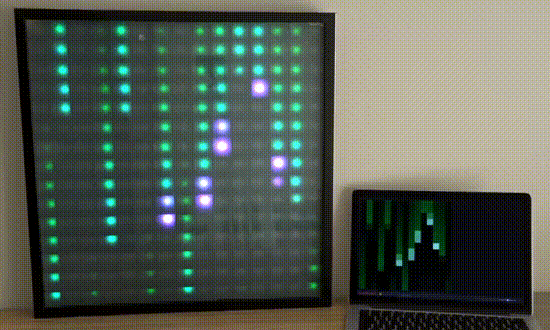
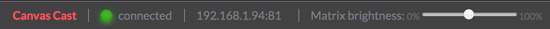

# Cast `<canvas>` to a Matrix using USB (Serial)



Built on top of [Canvas Cast](https://github.com/owenmcateer/canvas-cast) you can Cast a HTML `<canvas>` element from the browser to an LED Matrix over USB using a Serial connection with an Arduino/ESP8266.

If you want to cast over WiFi then please look at [Canvas Cast](https://github.com/owenmcateer/canvas-cast). 
**Canvas Cast Serial** is uses a USB Serial connection and is intended for large LED displays, higher framerate or simple when you don't have WiFi.

## Features:
 - Stream any canvas element over USB
 - Tested with 504 pixels at 60fps
 - 2D or 3D(WebGL)
 - Supports all popular LED types (powered by [FastLED](https://github.com/FastLED/FastLED))
 - Matrix brightness control
 - Matrix status pixel
 



## Getting started setup
In this example setup we're using:
* ESP8266 NodeMCU
* 15x15 RGB LED Matrix (WS2812B)
* 5V 10A PSU
* Laptop

### 1) Arduino/ESP8266
a. Open the [Arduino sketch file](arduino/Canvas-Cast-Serial.ino) and edit the following settings:
```c
// Matrix size
const uint8_t kMatrixWidth = 15;
const uint8_t kMatrixHeight = 15;
// Matrix settings
#define LED_PIN 3
#define COLOR_ORDER GRB
#define CHIPSET WS2812B
```
b. Upload sketch to the ESP8266.
c. On the Matrix, pixel zero([status pixel](arduino/README.md)) will light up green indacating Canvas Cast Serial is is ready.

### 2) Serial node server
a. Install require node packages:  
`npm install`  
b. Open and edit the node server serial port.
```javascript
serialPort: 'COM3', // eg. (COM3, /dev/tty-usbserial1)
```
c. Run node serial server:
`npm run start`  
d. Take note of the Canvas Cast address & port for the next step.

### 3) Web interface
a. Open src/index.html and edit the following config, found at the top of the document.
```javascript
// Config
const matrix = {
  // Matrix IP & port of ESP8266
  // This is the node serial server from step 2.
  ip: '192.168.1.65:8180', 
  // Matrix pixel size
  width: 15,
  height: 15,
};
```
b. Open src/index.html in the browser and enjoy!  
Check the status bar and [Matrix status pixel](./arduino/README.md). for help.